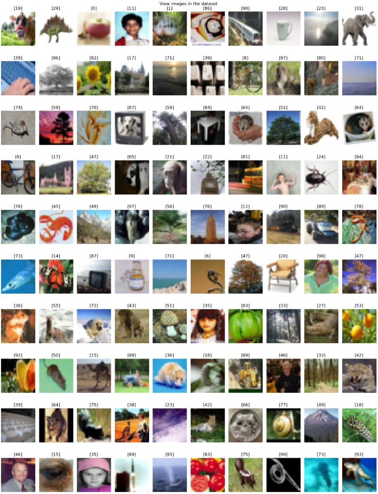
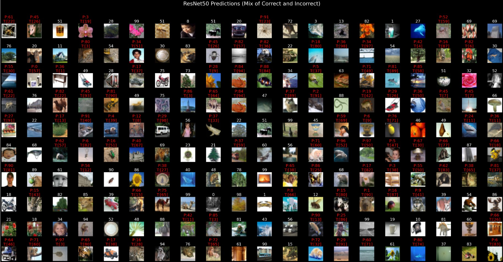
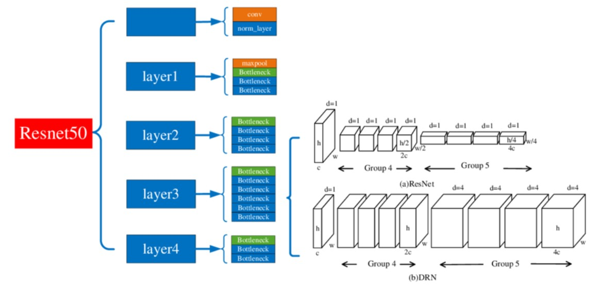
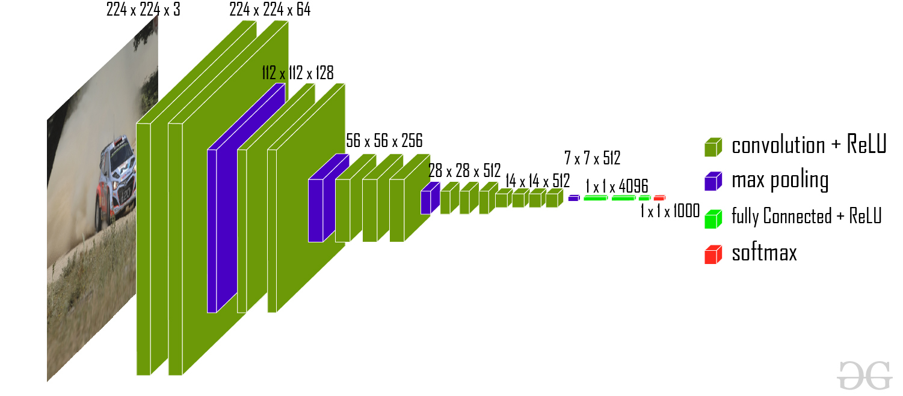
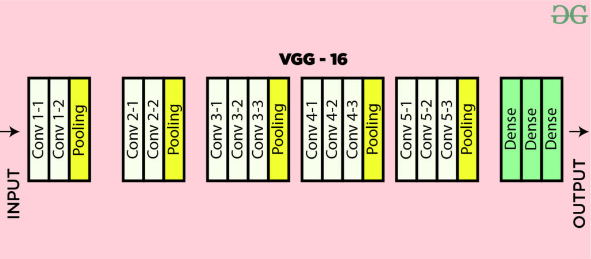
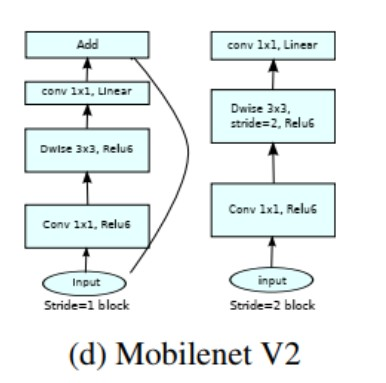

# Transfer_Learning
DL model to test transfer learning

> ## Project Assignment: Transfer Learning on cifar100 Dataset

This document outlines the steps for the project assignment on applying transfer learning to the cifar100 dataset.

**Objective:** Apply transfer learning techniques using pre-trained convolutional neural networks (ResNet50, VGG16, and MobileNetV2) to classify images from the cifar100 dataset. Compare the performance of the different models on this dataset.

**Dataset:** The CIFAR-100 dataset is a collection of 60,000 32x32 color images divided into 100 classes, with each class containing 600 images.

The CIFAR-100 dataset is organized into two main subsets:

|Set|	Number of Images|	Purpose|
|---|---|---|
|Training Set|	50,000|	Used for training models|
|Testing Set|	10,000|	Used for evaluating models|

The dataset has images from different objects, animals, scenes, people etc. which is grouped into 20 super class

|Superclass	|Classes
|---|---|
|aquatic mammals|	beaver, dolphin, otter, seal, whale
|fish|	aquarium fish, flatfish, ray, shark, trout
|flowers|	orchids, poppies, roses, sunflowers, tulips
|food containers|	bottles, bowls, cans, cups, plates
|fruit and vegetables|	apples, mushrooms, oranges, pears, sweet peppers
|household electrical devices|	clock, computer keyboard, |lamp, telephone, television
|household furniture|	bed, chair, couch, table, wardrobe
|insects|	bee, beetle, butterfly, caterpillar, cockroachlarge carnivores	bear, leopard, lion, tiger, wolf
|large man-made outdoor things|	bridge, castle, house, road, skyscraper
|large natural outdoor scenes|	cloud, forest, mountain, plain, sea
|large omnivores and herbivores|	camel, cattle, chimpanzee, elephant, kangaroo
|medium-sized mammals|	fox, porcupine, possum, raccoon, skunk
|non-insect invertebrates|	crab, lobster, snail, spider, worm
|people|	baby, boy, girl, man, woman
|reptiles|	crocodile, dinosaur, lizard, snake, turtle
|small mammals|	hamster, mouse, rabbit, shrew, squirrel
|trees|	maple, oak, palm, pine, willow
|vehicles 1|	bicycle, bus, motorcycle, pickup truck, train
|vehicles 2|	lawn-mower, rocket, streetcar, tank, tractor

 I will load this dataset using TensorFlow Datasets.

>**Sample images in the dataset cifar100:**

>**Project Steps:**

1.  **Introduction:**
    *   _Goal:_ Apply transfer learning for object classification using the Cifar100 dataset.
    *   The pre-trained models to be used: ResNet50, VGG16, and MobileNetV2.
    *   All of these three model are pre-train on imagenet dataset.
        *   ResNet50 - has **178** layer and **25,788,388** parameters
        *   VGG16 - has **22** layer and **15,028,644** parameters
        *   MobileNetV2 - has **157** layer and **3,672,228** parameters

2.  **Data Loading and Exploration:**
    *   Loading the dataset directly from tensorflow using  
  `from tensorflow.keras.datasets import cifar100`   
  `(X_train, y_train),(X_test,y_test) = cifar100.load_data()`
    *   Split the dataset into training and testing sets.
    *   Explore the dataset to understand its structure, the number of classes (100), and the image dimensions.

3.  **Data Preprocessing:**
    *   Preprocessing the images to fit the input size of the model used, using the below commands.
`X_train_resnet50 = preprocess_resnet50(X_train)`  
`X_train_vgg16 = preprocess_vgg16(X_train)`  
`X_train_mobilenetv2 = preprocess_mobilenetv2(X_train)`  
`X_test_resnet50 = preprocess_resnet50(X_test)`  
`X_test_vgg16 = preprocess_vgg16(X_test)`  
`X_test_mobilenetv2 = preprocess_mobilenetv2(X_test)`  
    *   This will resizing the images to the input size required by the pre-trained models.

4.  **Model Adaptation and Training:**
    *   For each of the three models (ResNet50, VGG16, MobileNetV2):
        *   Loading the pre-trained model from `tensorflow.keras.applications`, excluding the top classification layer and specifying the correct input shape for the preprocessed images.
        *   Add new custom layers on top of the base model for classifying 100 classes. This involves a GlobalAveragePooling2D layer and a Dense layer with 100 units and a 'softmax' activation.
        *   Freeze the layers of the pre-trained base model.
        *   Compile the model with an appropriate optimizer 'adam', loss function `sparse_categorical_crossentropy` and metrics `accuracy`.
        *   Compiled model on the preprocessed training data for **30** number of epochs. 
        *   Use the validation data to monitor performance during training. Considered using callbacks like ModelCheckpoint and EarlyStopping.
        *   Unfreeze 10% of the top layers of the base model and fine-tune the model with a lower learning rate.

5.  **Model Evaluation:**
    *   The models progress are evaluated based on training and validation accuracy and loss
    *   A comparative evaluation is also done among the three models to evaluate wihic model showed better performance.

6. **Conclusion**
   * Among the three models the ResNet50 has outperformed in terms of validation accuracy and loss.
   * ResNet50 shows 40% accuracy after running for 5 epoch.
  
7. **Limitation and Suggestion**
   * The there are only 600 images per level are available for training the data.
   * The hardware limitation and computationally expensive in running the model for large epochs
   * Experiment with different hyperparameters (learning rate, number of epochs, batch size).
   * Implement data augmentation techniques may help in creating new data for the model training
   *Fine-tuning different numbers of layers.

>Prediction

> # Trained model

[best_weight_mobilenetv2.weights.h5](https://github.com/Biswas-Tinku/DL_Projects/blob/main/Object_identification_using_Transfer_learning/best_weight_mobilenetv2.weights.h5)
[best_weight_vgg16.weights.h5](https://github.com/Biswas-Tinku/DL_Projects/blob/main/Object_identification_using_Transfer_learning/best_weight_vgg16.weights.h5)
[best_weight_resnet50.weights.h5]()

> # Model Architecture

> ResNet50  

ResNet, an acronym for Residual Network, is a deep learning architecture. ResNet-50 is a convolutional neural network architecture that is designed to improve image classification tasks image recognition, object detection, and feature extraction.  
It utilizes residual blocks with skip connections to address issues like the vanishing gradient problem, allowing for deeper networks to be trained effectively.

>VGG16

The VGG-16 model is a convolutional neural network (CNN) architecture that was proposed by the `Visual Geometry Group (VGG)`  
VGG-16 is renowned for its simplicity and effectiveness as well as its ability to achieve strong performance on various computer vision tasks including image classification and object recognition. Despite its simplicity compared to more recent architectures it remains a popular choice for many deep learning applications due to its versatility and excellent performance.

>MobileNet-V2

MobileNetV2 is a lightweight convolutional neural network designed for mobile and embedded vision applications, featuring inverted residuals and linear bottlenecks to improve efficiency and accuracy. It utilizes depthwise separable convolutions to reduce computational complexity while maintaining performance.

